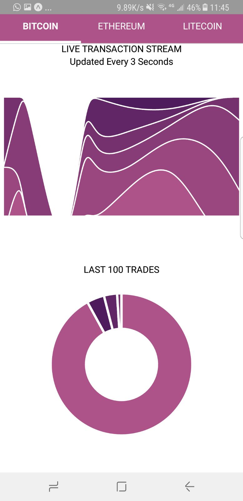

# CryptoControl #

## A cryptocurrency data vizualisation smartphone app ##

## proof of concept ##

This project uses crypto transaction data from gdax and visualises it in two seperate graphs using D3 and react native ART for SVG.

Upper Graph: stack chart

Lower Graph: donut chart
The lower graph animates between values using the *Morph.Tween* method of ART

### Instructions ###

#### nb- only tested on android ####

To run you must have react-native installed.
In terminal
- npm i
- react-native run-android

### Comments ###

Initially I used Morph.Tween to animate the upper stack chart. However, due to it being very non performant I removed this functionality.

In the future I would consider using Animated + Native Driver + Transforms as described in: https://engineering.salesforce.com/experiments-with-high-performance-animation-in-react-native-80a0cb7052b0

Further animation reading:
https://medium.com/react-native-training/react-native-animations-using-the-animated-api-ebe8e0669fae
